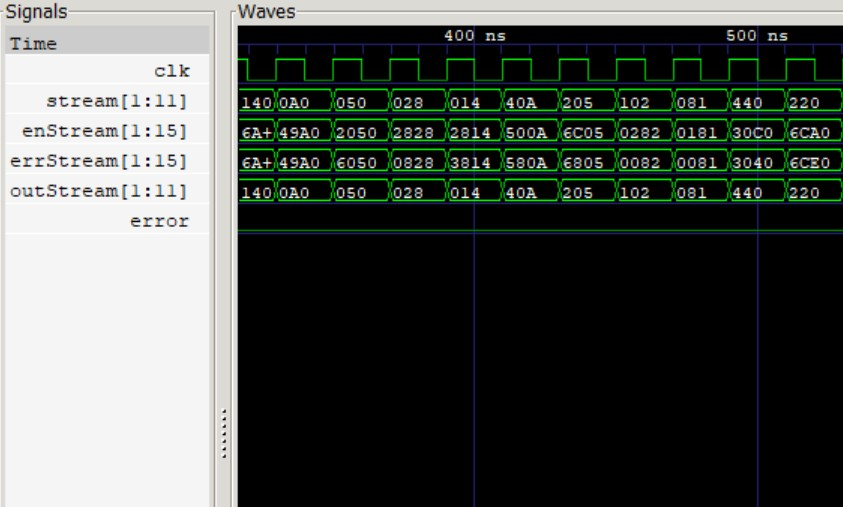

# Digital Circuit Error Analysis
> Implementation and Analysis of Various Error Detecting and Correcting Protocols

## 🧐 About 
This project was initially for my COT3100 Intro to Discrete Structures Final Project. The purpose of this work is to analyze and implement various methods to address errors in digital circuits. These methods were implemented in Verilog and validated through testbenches. Through these implementations and analysis, I wrote a paper on my findings and work.

[Error Correction and Detection in Digital Circuits](https://github.com/TWilliamsA7/DigitalErrorAnalysis/blob/main/DigitalErrorAnalysis.pdf)

## 💫 Example

## ▶ Error Protection Methods
- **Brute Force** 💢
    - Providing 2 or more duplicate bits for each bit of the stream to create extreme redundancy protection
- **Hamming Codes** 🔨
    - Using parity bits on specific bit positions to check the evenity of the amount of 1's to find and correct errors
- **Cyclic Redundancy Checks** 🌀
    - Use a divisor to create a code to check if there has been a change in transmission when the divisior is used again
- **Bose-Chaudhuri-Hocquenghem Codes** ⏬
    - Use generator polynomials and roots to transform and find errors within the data stream.
- **Linear Feedback Shift Registers** ❓

## :phone: Contact
Tai Williams - twilliamsa776@gmail.com
https://github.com/TWilliamsA7/DigitalErrorAnalysis/tree/main